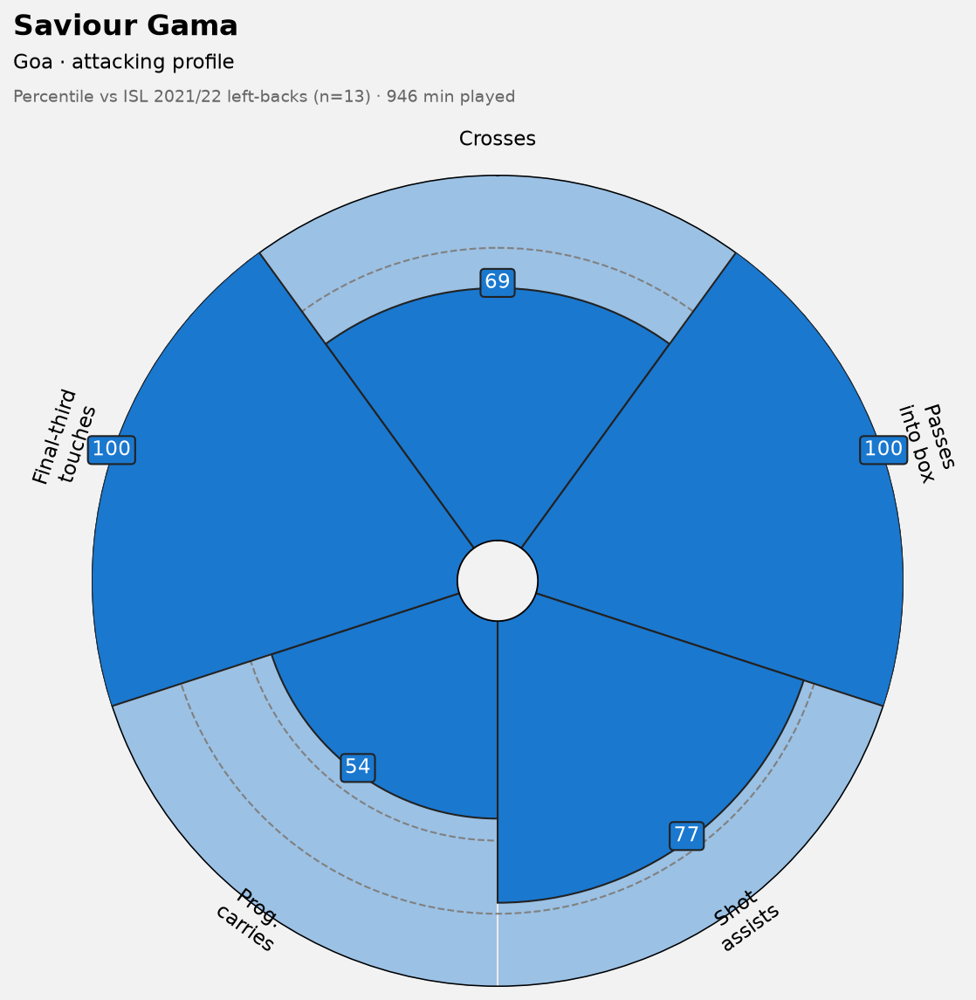

# Scouting Report — Attacking Left-Back, Indian Super League 2021/22

**Player:** Saviour Gama  ·  **Club:** Goa  ·  **Position:** Left Wing-Back (LWB)  ·  **Minutes:** 946
**Author:** *Example / model report*  ·  **Data:** StatsBomb Open Data

---

## 1. Summary verdict

Gama is the most advanced creator among left-backs in the 2021/22 Indian Super
League: no full-back in the division gets into the final third or feeds the box
more often, and he does it with better-than-average delivery quality. He profiles
as an auxiliary attacker down the left, best suited to a possession side or a
back-three that pushes its wing-backs high. He is a **watch-further**, not a
sign-on-sight — the profile is flattered by his advanced role and rests on the
thinnest minutes sample in the pool, and this analysis says nothing about his
defending. Verify on video before acting.

## 2. Context & brief

Scouted against a common recruitment need: a modest side looking for an attacking
left-back or wing-back who adds width and final-third delivery, sourced cheaply
from an under-scouted market rather than a top-five league.

## 3. What the data says — strengths

**He lives in the final third.** 47.8 final-third touches per 90 — the highest of
any left-back in the league (1st of 13). This is not a defender who occasionally
overlaps; his baseline position is high, and he is involved in the attack
continuously.

**He is the league's best box-feeder from the position.** 0.67 completed open-play
passes into the penalty area per 90, again 1st of 13. The distinction matters:
plenty of full-backs rack up touches by recycling possession sideways. Gama's
volume converts into deliveries that reach the danger zone.

**The end product is real, not incidental.** 0.57 shot assists per 90 places him
3rd of 13 (77th percentile). He does not just enter the final third — his passes
turn into shots at a rate few peers match.

**When he crosses, he tends to find a teammate.** 38% cross completion is among the
best in the pool. His crossing volume is only middling (69th percentile), so the
read is quality over quantity: a selective deliverer rather than a hopeful one.

## 4. Limitations in his game — weaknesses

**He is not a ball-carrier.** 5.4 progressive carries per 90 is dead-median (54th
percentile). He receives high rather than driving from deep, so a side that needs
a left-back to carry out of pressure and beat a first line of press will not get
that here — his value is delivered at the end of moves, not at their start.

**Volume crossing is not his game.** A team wanting relentless width and a high
cross count would be better served elsewhere in this same pool; Gama offers fewer,
better balls, not a barrage.

## 5. Methodology & caveats

- **League choice.** The Indian Super League 2021/22 was the only competition in
  the available open data with full-season coverage (115 matches, 11 teams). The
  alternatives were unusable: MLS 2023 held only 6 matches, and La Liga open data
  covers Barcelona's fixtures alone.
- **Pool definition.** Players whose *modal* position across the season was
  Left-Back or Left Wing-Back, with 900+ minutes — 13 players. Filtering on modal
  position (not "played there once") was essential: it removed wingers and
  forwards who briefly covered the flank and would otherwise have topped the
  attacking metrics as an artefact of their role, not their quality.
- **Normalisation & ranking.** All metrics are per-90 and expressed as percentiles
  *within this league only*. No cross-league comparison is made — that would
  require a league-strength adjustment the open data does not support.
- **Sample size.** With n=13, percentiles are coarse; findings are stated as ranks
  ("1st of 13"), not fine gradations.
- **Proxy metric.** "Shot assists" (a pass directly leading to a shot) is used as a
  free proxy for expected assists; richer possession-value metrics sit behind
  StatsBomb's paid tier.
- **Player-specific flags.** Gama plays wing-back, so his side's system stations
  him high — a share of his advanced numbers reflects Goa's setup, not the player
  in isolation. His 946 minutes is the lowest in the pool, making his percentiles
  the least stable of the group.

## 6. Recommendation & next step

**Watch further, conditionally.** The attacking case is strong enough to justify
live viewing, but three things must be checked that this data cannot answer:

1. **Defending.** This report is offence-only; a full-back must defend. His
   one-v-one defending, recovery running and positioning need video assessment
   before any move.
2. **System dependence.** Confirm the final-third output survives outside Goa's
   wing-back setup — would the numbers travel to a side that asks him to defend more?
3. **Athletic profile.** Repeatability of high positioning over a full season at a
   higher level.

**Alternative in the same pool:** Muhammad Ashique Kuruniyan (Bengaluru) is the
volume-and-progression option — top of the league for crosses and a strong
carrier, but with a weaker end product (median shot assists, 21% cross
completion). Choose Gama for a creator wing-back in a possession or back-three
system; choose Ashique for a carrier who provides width when a reliable finisher
is already in place.